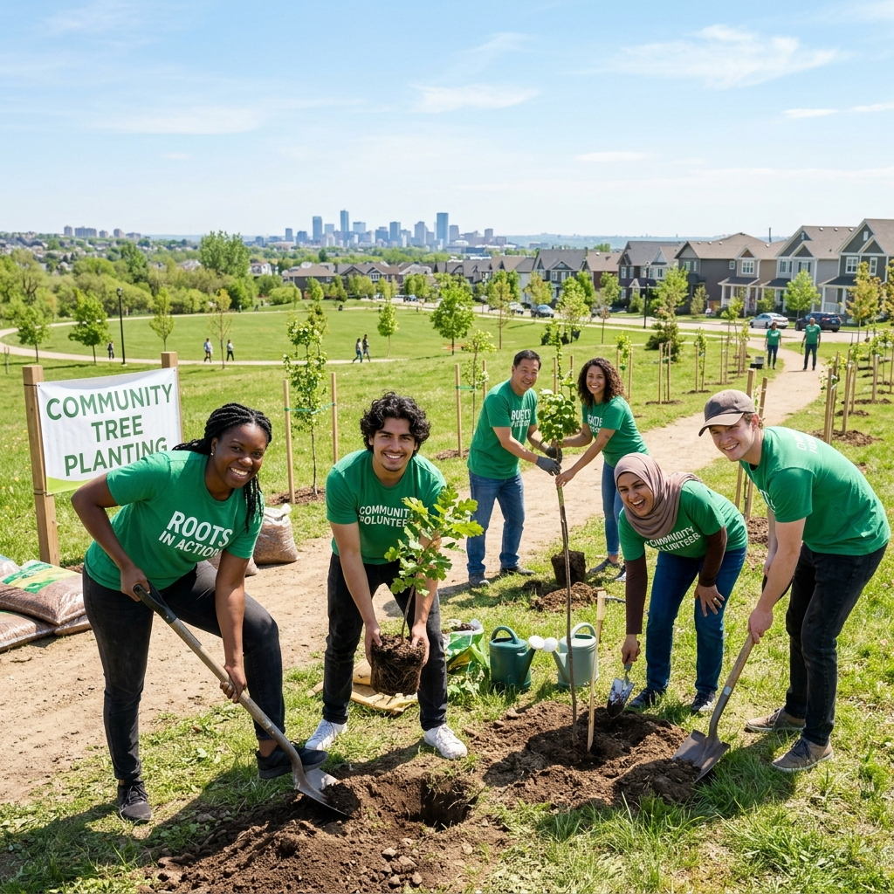

<div align="center">
  
  <br><br>
  <h1>InAmigos NGO Awareness Website</h1>
</div>

## Project Overview

This project was developed as part of the Web Development Internship Task assigned by **InAmigos Foundation**.

The objective of this project is to create an awareness webpage that highlights the mission, initiatives, ongoing projects, social impact, and volunteer opportunities offered by InAmigos Foundation.

The website is designed to be responsive, user-friendly, visually appealing, and accessible across different devices.

---

## Features

* **Responsive Design:** Fully adaptive for Mobile, Tablet, and Desktop screens.
* **Modern NGO-Themed UI:** Clean, green-and-white color palette to match foundation branding.
* **Hero Section:** Engaging landing page with a Call-to-Action.
* **About Us Section:** Clear and concise information about the foundation.
* **Ongoing Projects Showcase:** Grid layout of major initiatives.
* **AI-Powered Research:** Dedicated section presenting data analysis, AI insights, and employability trends in the NGO sector.
* **Social Impact Statistics:** Animated counters to display data effectively.
* **Image Gallery:** Dynamic grid layout to showcase foundation events and activities.
* **Volunteer & Donation:** Dedicated Call-to-Action section.
* **Contact Section:** Form layout with address and social links.
* **Smooth Scrolling Navigation:** Interactive user experience.
* **Mobile-Friendly Menu:** Custom hamburger navigation for small screens.
* **Interactive Hover Effects:** Subtle and modern card transitions.

---

## Technologies Used

### Frontend
* **HTML5:** Semantic structuring.
* **CSS3:** Custom styling and visual presentation.
* **JavaScript (Vanilla JS):** Core interactivity and DOM manipulation.

### Design Techniques
* **Flexbox & CSS Grid:** For robust layout construction.
* **Responsive Design & Mobile-First Approach:** Ensuring cross-device compatibility.
* **CSS Animations:** Enhancing user engagement.

---

## Project Structure

```text
InAmigos-NGO-Awareness-Website
│
├── index.html          # Main HTML markup
├── style.css           # Custom CSS styling
├── script.js           # Navigation and Animation logic
│
├── Report/             # Downloadable reports
│   └── AI_Social_Impact_Report.pdf
│
└── img/                # All static image assets
    ├── hero_bg.jpg
    ├── impact_bg.png
    ├── about_volunteers.png
    ├── proj1_edu.jpg
    ├── proj2_food.jpg
    ├── proj3_women.jpg
    ├── proj4_community.jpg
    ├── proj5_environment.jpg
    ├── proj6_animal.jpg
    └── gallery images...
```

---

## Website Sections

### 🏠 Home
Introduction to InAmigos Foundation and its mission.

### ℹ️ About
Overview of the organization and its purpose.

### 🌟 Projects
Highlights of major initiatives including:
* Education Support
* Food Distribution
* Women Empowerment
* Community Development
* Environmental Initiatives
* Animal Welfare

### 📈 Impact
Displays key statistics related to volunteers, beneficiaries, causes, and outreach using animated counters.

### 🧠 AI Insights
Detailed analysis and trends on how AI tools and full-stack mentorship are bridging the digital divide, complete with a downloadable PDF report.

### 📷 Gallery
Visual representation of activities and community engagement.

### 📞 Contact
Contact information and social media links.

---

## Learning Outcomes

Through this project, I improved my understanding of:
* Semantic HTML Structure
* Responsive Web Design techniques
* Practical application of CSS Grid and Flexbox
* User Interface (UI) Design Principles
* JavaScript DOM Manipulation and Event Listeners
* Website Deployment

---

## Internship Task Information

* **Organization:** InAmigos Foundation
* **Task:** NGO Awareness Webpage Creation
* **Objective:** Design and develop a webpage that promotes awareness about the NGO, its projects, impact, and volunteer opportunities.

---

## Deployment

This project contains zero external dependencies and can be hosted simply and freely using:
* [GitHub Pages](https://pages.github.com/)
* [Netlify](https://www.netlify.com/)
* [Vercel](https://vercel.com/)

---

<div align="center">
  <p><strong>Developed as part of the Web Development Internship Program.</strong></p>
  <p><em>Made with HTML, CSS, and JavaScript.</em></p>
</div>
